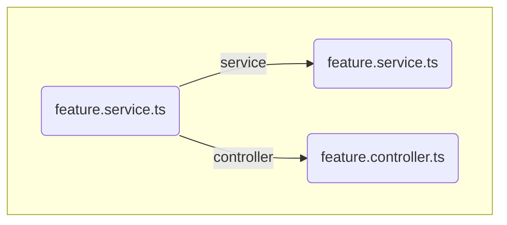
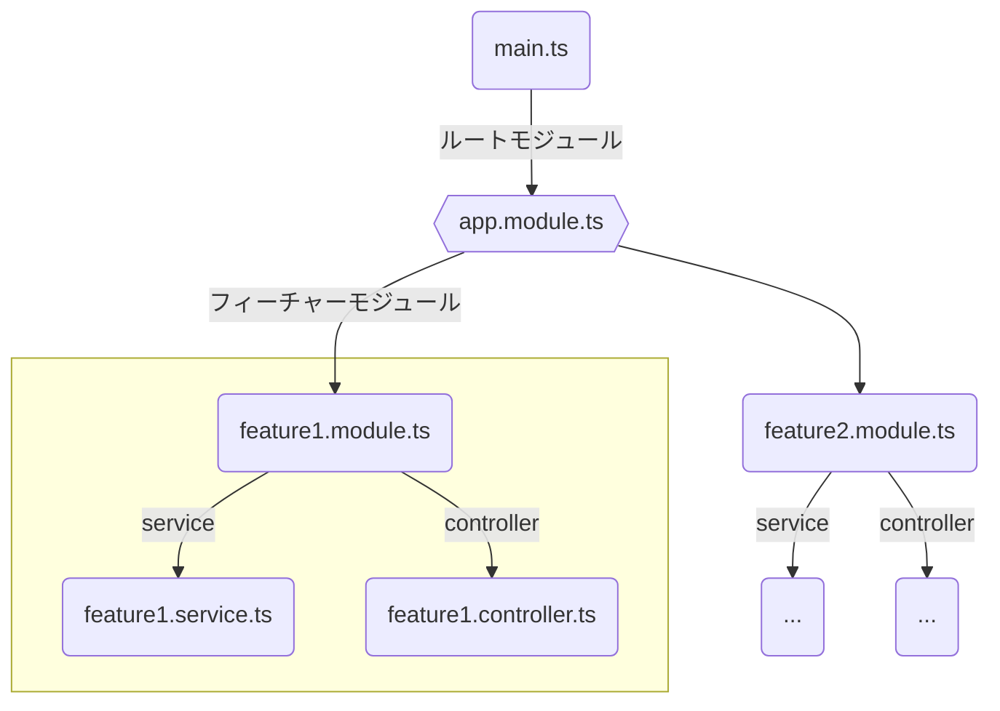

# 基本アーキテクチャ

## NestJSの基本3要素
- Module
- Service
- Controller

## 1アプリケーションの構成

- `feature.service.ts`, `feature.controller.ts`を`feature.module.ts`に登録する
- `feature.module.ts`を`app.module.ts`に登録する
- `app.module.ts`が`main.ts`にモジュールを登録する
- **`main.ts`で`feature.module.ts`が使用できる**
:::message
黄色い枠内のサービス, コントローラ, モジュールのセットを機能ごとに作る
	- 機能毎にモジュールを`app.module.ts`(ルートモジュール)に登録する
:::

## Moduleの定義
関連するController、Serviceをまとめて登録する役割

- クラスに`@Module`をつけてプロパティを記述する
- `providers` : `@Injectable`　サービスクラスなどを記述する
	- dipendency injectionができる
- `controllers` : `@Controller` コントローラークラスを記述する
- `imports` : 外部モジュール**から**インポートして使いたいもの
- `exports` : エクスポートして外部モジュール**でも**使いたいもの
	- `imorts`, `providers`に記載したもの