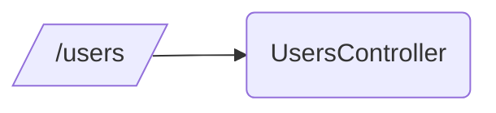
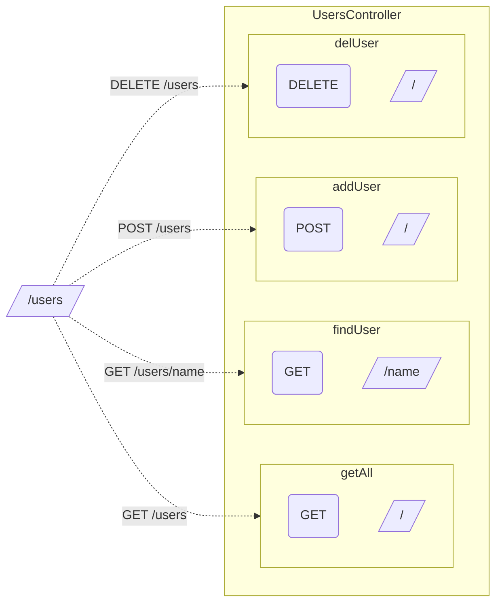

# 0. プロジェクト作成
- Nest CLIをインストールする
```shell
npm i -g @nestjs/cli
```
- 新規プロジェクトを作成する
```shell
nest new server 
```
- 作成されるフォルダ構成
```shell
.
└── server/
    ├── README.md
    ├── nest-cli.json
    ├── node_modules/
    ├── package-lock.json
    ├── package.json
    ├── src/
    ├── test/
    ├── tsconfig.build.json
    └── tsconfig.json
4 directories, 6 files
```
## まずいらないファイルを消そう

https://github.com/mfunyu/pre-transcendence/commit/9307f397a3e22c6b2c6fffd0aea7f8f8d859220a#diff-089f4f2474b64391c42b6e66aed33977e132058d92108f0a63234a7862e1f8b8
以下のファイルを削除
- `app.controller.spec.ts`
- `app.controller.ts`
- `app.service.ts`

それに合わせて`app.module.ts`を以下のように修正

https://github.com/mfunyu/pre-transcendence/blob/9307f397a3e22c6b2c6fffd0aea7f8f8d859220a/src/app.module.ts

# 1. モジュールを作成する
https://github.com/mfunyu/pre-transcendence/commit/6fcb7c6857f00d84d24dbf63c564e74938efa5d1

:::message
Nest CLIを活用して簡単にモジュールを作成できる
`nest g module [モジュール名]`(g == generate)
:::

## モジュール作成
```shell
$> nest g module users
CREATE src/users/users.module.ts (82 bytes)
UPDATE src/app.module.ts (195 bytes)
```
ファイルを見ると以下の変更が加えられている
1. `users.module.ts`（新規作成される）
```diff js:users.module.ts
+ import { Module } from '@nestjs/common';
+ 
+ @Module({})
+ export class UsersModule {}
```

2. `app.module.ts`（新しいモジュールが追記される）
```diff js:app.module.ts
 import { Module } from '@nestjs/common';
+import { UsersModule } from './users/users.module';
 
 @Module({
-  imports: [],
+  imports: [UsersModule],
   controllers: [],
   providers: [],
 })
export class AppModule {}
```
# 2. Controllerを作成する
## Controllerとは
**ルーティング**の役割を担う
- クライアントからのリクエストを受け付け、クライアントにレスポンスを返す
### Controller内で定義するもの
1. パスとコントローラーの紐付け

2. HTTPメソッド（GET・POSTなど）とパスを指定したメソッド ＝ **ハンドラー**




### 定義方法
1. クラスに `@Controller()` (**@Controllerデコレーター**) をつける
2. クラス内のメソッド（ハンドラー）に`@Post()` `@Get()`などの**HTTPメソッドデコレーター**をつける

## Controller作成
https://github.com/mfunyu/pre-transcendence/commit/1b1b63df82365ff6459d080fb887185e47145b01
```shell
$> nest g controller users --no-spec
CREATE src/users/users.controller.ts (99 bytes)
UPDATE src/users/users.module.ts (170 bytes)
```
:::message
`--no-spec`でテストファイルを生成しないように指定できる
:::

# 3. Serviceを作成する
## Serviceとは
実現したい機能（**ビジネスロジック**）を定義する
- Controllerに書いても機能するが、serviceに分けて書くのが理想
### 定義方法
1. クラスに `@Injectable()` (**@Injectableデコレーター**) をつける
2. クラス内に実現したい機能（ビジネスロジック）を実現するメソッドを作成する

## ControllerからServiceを利用する
1. 登録する
	-  ModuleのprovidersにServiceを登録する
3. 引数に取る
	- ControllerのコンストラクタでServiceを引数に取る

## Service作成
https://github.com/mfunyu/pre-transcendence/commit/1c2c2fb73ccba493ab1fecba5b6829ace8fbcf1a
```shell
$> nest g service users --no-spec
CREATE src/users/users.service.ts (99 bytes)
UPDATE src/users/users.module.ts (170 bytes)
```