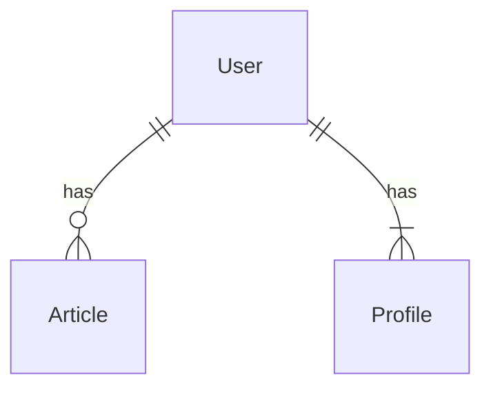

# 参考資料
*"NestJS - Building Real Project API From Scratch" - Section2.7*
https://www.udemy.com/course/nestjs-building-real-project-api-from-scratch/

# PostgreSQLって何？
- データベース
  - オープンソース
  - リレーショナルデータベース (後述)

# その他のデータベース
NestJSのプロジェクトに使われる他のDB
- MongoDB ([NestJS公式 Mongoのドキュメント＞＞＞](https://docs.nestjs.com/techniques/mongodb))

## Why PostgreSQL？
1. リレーショナルデータベース（RDB）だから
  - データベースには大きく分けて2つのタイプがある

   | リレーショナルデータベース |  | ドキュメント指向データベース |
   |:---:|:---:|:---:|
   | 行と列からなる"表" | データ形式 | JSON |
   | テーブル | データの呼び方 | ドキュメント |
   | ある | テーブル定義 (スキーマ) | ない (スキーマレスデータベース) |
   | ある | 関係性 | ない |
  ##### リレーショナルデータベースのメリット
  - 複数の表を**関連付けて**データ処理ができる
  - データ処理が一貫している
  - 複数テーブルで構成されるため、追加や削除などの処理コストが低い
  ##### ドキュメント指向データベースのメリット
  - **複雑な階層**でも管理することができる
  - クエリやインデックスの作成が容易
  - 大量データでも拡張しやすい

  #### リレーションシップとは?
  - テーブル間の関係性のこと
  - 以下の図のように、アプリケーションでは、各データが関係性を持つことが多い

  - 関係性を使う場合には
:::message
リレーション（関係）と呼ぶ**概念**でモデル化された表に似た構造を**テーブル**と呼ぶ
:::

2. VS MySQL [^6]

[^6]: [NestJS - Building Real Project API From Scratch: Section2.7](https://mercari.udemy.com/course/nestjs-building-real-project-api-from-scratch/learn/lecture/26416368#overview)

他の有名なリレーショナルデータベースとして**MySQL**がある

  - MySQLに対してPostgreSQLは
    - より機能的
    - stable
    - ユーザーフレンドリー

